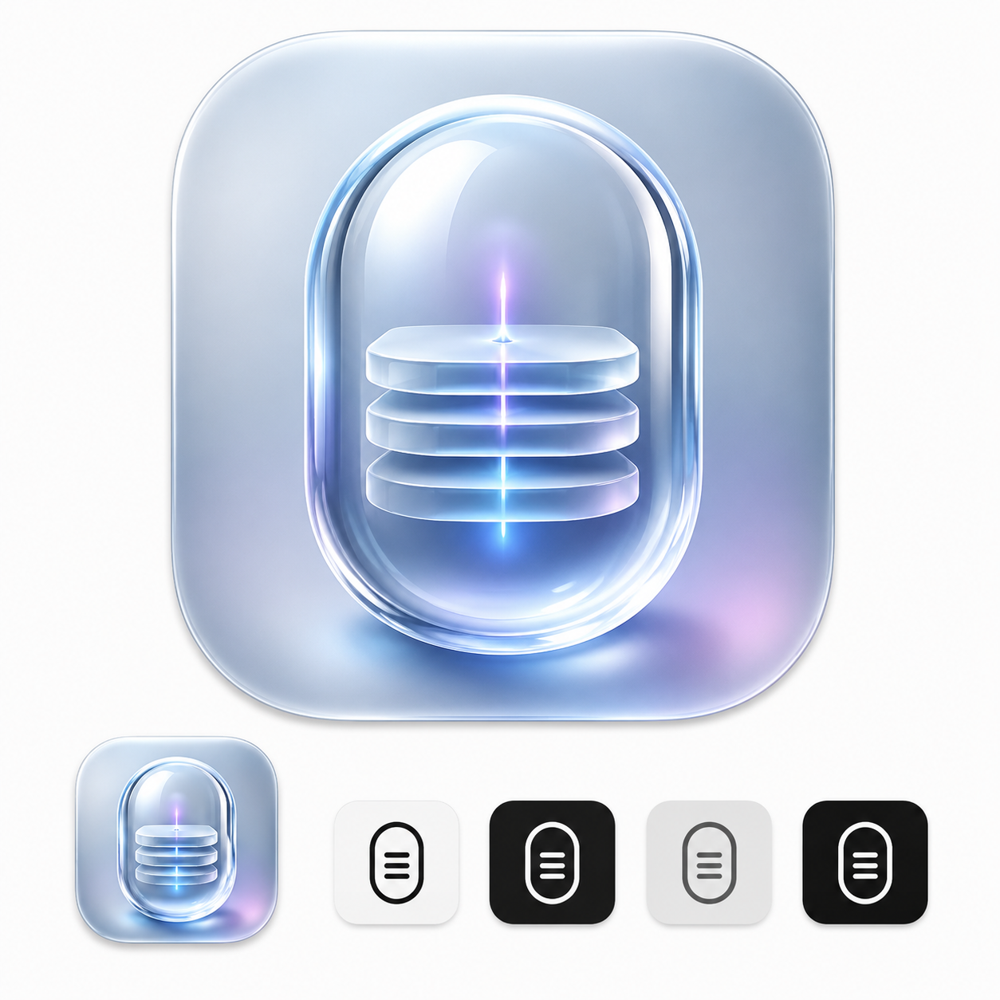
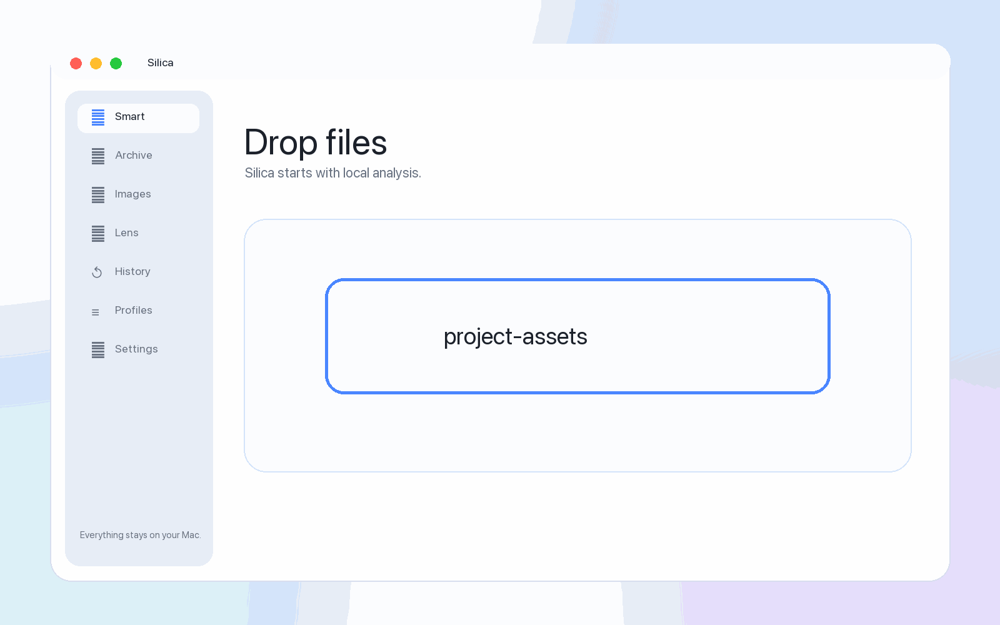
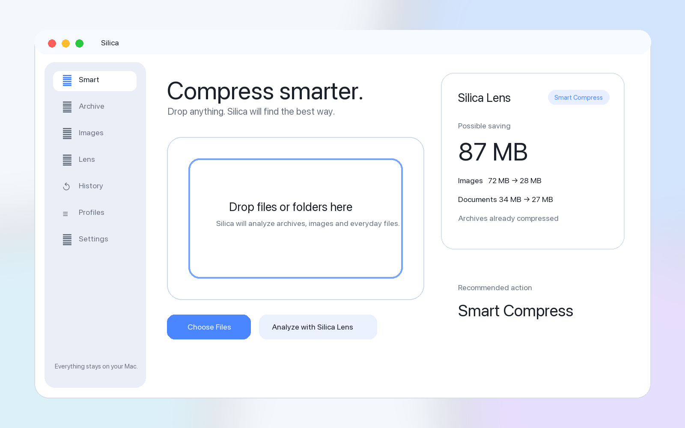
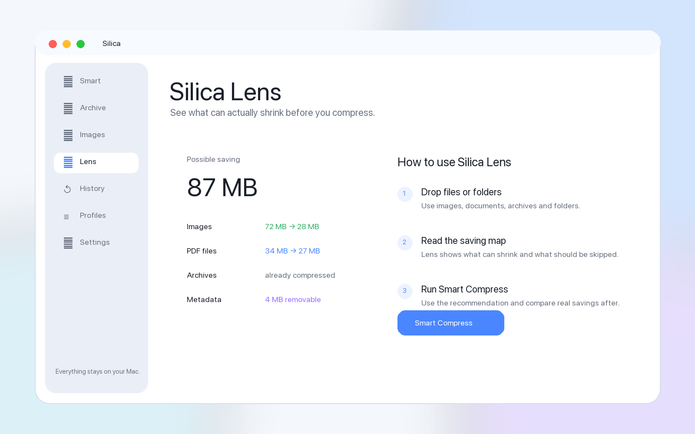
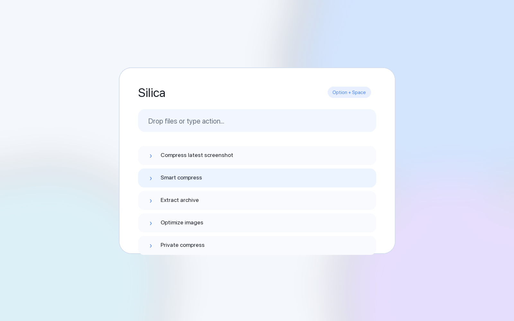
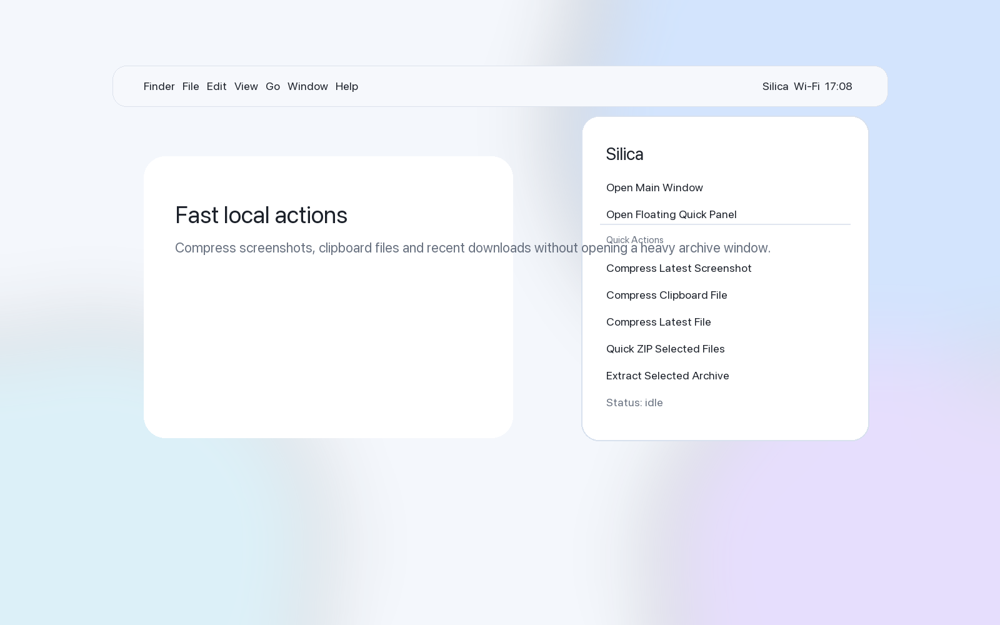

# Silica

[](https://developer.apple.com/macos/)
[](https://swift.org)
[](https://developer.apple.com/xcode/swiftui/)
[](LICENSE)



Silica is a beautiful native macOS compressor for archives, images and everyday files.

Not just another archive utility — Silica explains what can actually shrink before you compress it.

It is not trying to be another WinRAR clone. Silica is designed like a modern Apple utility: quiet, local-first, fast to use, and focused on explaining where space can actually be saved.

## Demo



## Screenshots

### Smart Compression



### Silica Lens



### Quick Panel



### Menu Bar



## Why Silica

Most archive apps compress files and leave the user guessing. Silica adds a product layer around everyday compression:

- **Silica Lens** explains what can shrink, what is already compressed, and what should be skipped.
- **Smart Compress** chooses a practical local workflow for mixed files.
- **Floating Quick Panel** opens above your workspace for fast commands.
- **Profiles** provide one-click presets for Telegram, Website, Email, Private Mode and Fast ZIP.
- **Private Mode** avoids history and favors metadata removal.
- **Menu Bar actions** handle screenshots, clipboard files and recent downloads.

## Current Status

Silica is an early native macOS app scaffold with working local operations and product UI. It is ready for contributors, experiments and the next release-hardening phase.

Implemented:

- SwiftUI macOS app, macOS 14+
- Apple-style sidebar: Smart, Archive, Images, Lens, History, Profiles, Settings
- Drag and drop for files, folders, archives and images
- ZIP create/list/test/extract
- TAR, TAR.GZ, GZIP-style tarballs, BZIP2 and XZ paths through macOS `tar`
- 7Z backend detection for `7zz` / `7z`
- Image optimization through ImageIO
- HEIC/WEBP availability checks
- Image preview grid
- Silica Lens analysis with metadata-aware estimates
- Floating Quick Panel via `NSPanel`
- Reconfigurable global Quick Panel shortcut
- Experimental top-center/notch-style Quick Panel positioning
- Menu Bar actions
- History with filters, repeat and delete
- Editable profiles
- First-launch setup with language, theme, hotkey and defaults
- English/Russian in-app language switch for key flows
- Release scaffolding: app bundle script, entitlements, Info.plist, privacy draft
- XCTest coverage for Smart Analyzer and ZIP archive flow

## Quick Start

Requirements:

- macOS 14 Sonoma or newer
- Xcode 15 or newer
- Swift 5.9+

Build and test:

```bash
swift test
```

Create and open a local app bundle:

```bash
Scripts/package_app.sh
open build/Silica.app
```

Opening `build/Silica.app` is recommended for testing system integrations. `swift run Silica` works for smoke checks, but macOS may print system warnings because SwiftPM executables do not have a normal app bundle identifier.

## Run From Xcode

1. Open Xcode.
2. Choose **File > Open...**.
3. Select this repository folder.
4. Xcode opens `Package.swift`.
5. Select the **Silica** scheme.
6. Choose **My Mac**.
7. Press **Cmd+R**.

## Project Layout

```text
Silica/
  App/                  App entry, routing, app delegate, global hotkey
  Core/                 Archive engine, image optimizer, smart analyzer
  Models/               Codable app/domain models
  Services/             Preferences, history, Finder, notifications, panels
  UI/                   SwiftUI screens and reusable components
  Resources/            Assets and strings
Tests/
  SilicaTests/          XCTest coverage
Release/                Entitlements, Info.plist and release metadata
Scripts/                Local packaging script
```

## Roadmap

Short term:

- Full Xcode workspace with app target and extension targets
- Finder Sync Extension and Quick Actions
- Better archive progress parsing
- Image before/after comparison
- Quick Look archive preview
- More complete Russian localization

Backends:

- Bundled or user-configurable 7Z backend
- Bundled or user-configurable RAR extraction backend
- ZSTD support
- Split archives
- DMG/ISO preview or mount flow

Release:

- Hardened runtime and Developer ID signing
- Notarization
- App Store packaging research
- StoreKit-based Pro gates, if the project chooses freemium

See [TODO.md](TODO.md) for the detailed backlog.

## Privacy

Silica is designed as a local-first app.

- Files are processed locally.
- No cloud compression is used.
- No analytics are included.
- Archive passwords should be stored only in Keychain.
- Private Mode avoids operation history and favors metadata removal.

## Contributing

Contributions are welcome. Good first areas:

- Archive backend adapters
- Finder Sync and Quick Actions
- Image optimization fixtures
- UI polish and accessibility
- Localization
- Tests

Read [CONTRIBUTING.md](CONTRIBUTING.md) before opening a pull request.

## License

Silica is open source under the [MIT License](LICENSE).
